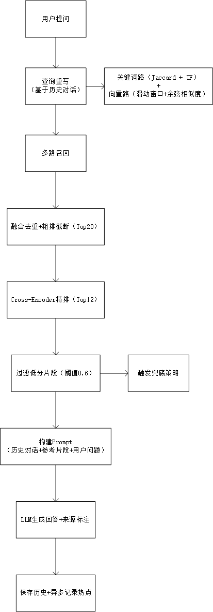

# Knowledge Agent - RAG 文档问答系统

基于检索增强生成（RAG）的智能文档问答系统，支持 PDF/DOCX/MD/TXT 上传、语义检索、精排与对话历史管理。

## 技术栈

| 层级 | 技术 |
|------|------|
| 后端框架 | Spring Boot 3.x |
| 向量模型 | BgeSmallZh（Embedding） |
| 精排模型 | Cross-Encoder（本地 ONNX） |
| 大模型 API | DeepSeek / OpenAI 兼容接口 |
| 缓存/队列 | Redis（AOF+RDB）+ RabbitMQ |
| 数据库 | MySQL 8.0 |
| 部署 | Docker Compose |

## 核心特性

- **多路召回**：关键词匹配（Jaccard + TF）+ 向量语义检索（滑动窗口避免长文档淹没）
- **查询重写**：基于历史对话的指代消解与语义扩展
- **Cross-Encoder 精排**：重排序候选片段，阈值 0.6 过滤低分
- **热点缓存**：24h 内被问 ≥3 次自动晋升，减少重复 LLM 调用
- **兜底策略**：文档无答案时，基于历史对话生成推测回答
- **安全上传**：路径遍历过滤、扩展名白名单、Magic Number 文件头校验

## 快速启动

```bash
# 1. 配置环境变量
cp .env.example .env
# 编辑 .env 填写 DEEPSEEK_API_KEY 和 MYSQL_PASSWORD

# 2. 启动所有服务
docker-compose up -d

# 3. 访问
# 前端页面：http://localhost:8080
# 健康检查：http://localhost:8080/actuator/health
```

## 核心流程

